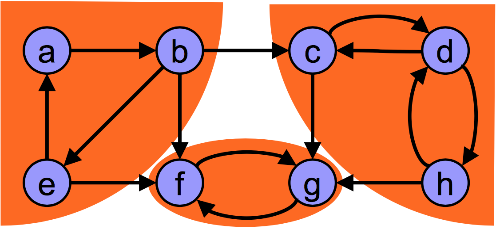

# Kosaraju-Sharir's algorithm implementation in C++

- Performs two complete traversals of the graph
- If the graph is represented as an adjacency list, then the algorithm runs in Theta(|V|+|E|) time (linear)
- If the graph is represented as an adjacency matrix, then the algorithm runs in Big-O(|V|^2) time



## Pseudocode

```
input: graph G = (V, E )
output: set of strongly connected components (sets of vertices)

S = empty stack;

while S does not contain all vertices do
  Choose an arbitrary vertex v not in S;
  DFS-Walk’(v ) and each time that DFS finishes expanding a vertex u, push u onto S;

Reverse the directions of all arcs to obtain the transpose graph;

while S is nonempty do v = pop(S);
  if v is UNVISITED then DFS-Walk(v );
  The set of visited vertices will give the strongly connected component containing v;
```

```
procedure DFS-Walk(Vertex u ) {
  state[u] = OPEN;
  for each Vertex v in succ(u )
    if (state[v ] == UNVISITED) then DFS-Walk(v);
  state[u ] = CLOSED;
}

procedure DFS-Walk(Vertex u ) { 
  state[u] = OPEN;
  for each Vertex v in succ(u )
    if (state[v ] == UNVISITED) then DFS-Walk(v);
  state[u ] = CLOSED;
  push u to S;
}
```

