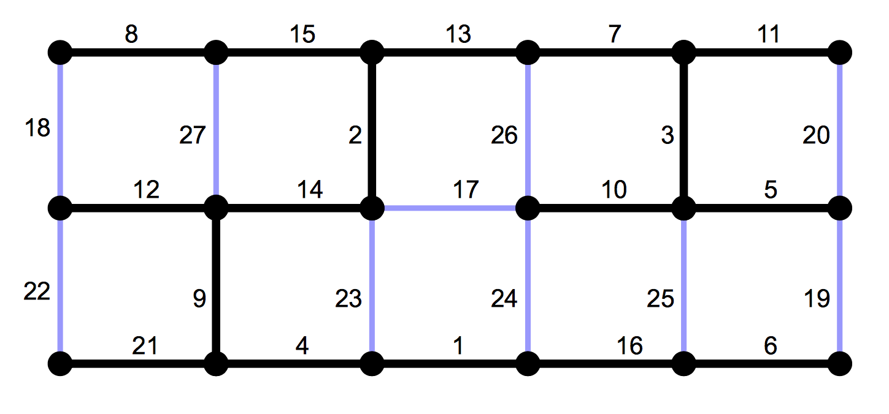

# Minimum spanning tree algorithms

- [Borůvka's algorithm](https://github.com/klimesf/b4m33pal-examples/tree/master/minimum-spanning-tree/boruvka)
- [Kruskal's algorithm](https://github.com/klimesf/b4m33pal-examples/tree/master/minimum-spanning-tree/kruskal)
- [Prim's algorithm](https://github.com/klimesf/b4m33pal-examples/tree/master/minimum-spanning-tree/prim)

## Graph

