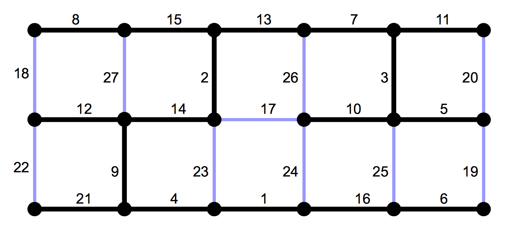

# Borůvka's algorithm implementation in C++

- Borůvka’s algorithm stops after max. log2 |V(G)| and the result is a minimum spanning tree of the graph G



## Pseudocode

```
input: A graph G with a weight function w : E(G) -> Readl numbers , where all weights are different.

K := (V(G), ∅)
while K has at lwast two connected components {
	For all components Ti of graph K
	 the light incident edge* ti is chosen
	All edges ti are added to K
}

output: a minimum spanning tree K

* A light incident edge is an edge connecting a connected component Ti connected component while a weight of this edge is the lowest.
```
